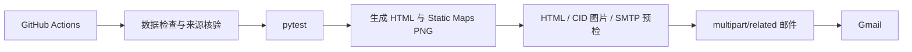

# Dublin House 2026

南都柏林住房销售日报与租赁周报的自动化监控、地图生成、HTML 邮件预检和发送项目。

Codex 接手时先阅读：

- [`AGENTS.md`](AGENTS.md)：代码代理必须遵守的项目规则
- [`docs/CODEX_HANDOFF.md`](docs/CODEX_HANDOFF.md)：两条流水线的现状、入口、已知缺口和验收清单
- [`docs/EMAIL_STANDARD.md`](docs/EMAIL_STANDARD.md)：固定邮件和 Google 地图格式

## 两个正式任务

| 任务 | 频率 | GitHub Actions | 命令入口 |
|---|---|---|---|
| **住房销售日报** | 每天 07:00（Europe/Dublin） | `.github/workflows/sales.yml` | `scripts/run_sales.py` |
| **住房租赁周报** | 每周一 07:00（Europe/Dublin） | `.github/workflows/rental.yml` | `scripts/run_rental.py` |

GitHub Actions 是唯一正式调度源。不要同时启用另一套 ChatGPT、系统 cron 或本地任务发送同一邮件。

## 统一执行模型



所有关键步骤采用 fail-closed 策略：数据、测试、地图、HTML、CID 图片或 SMTP 任一检查失败，都不会发送邮件。

## Google 地图交付方式

Google Static Maps URL只用于运行时下载 PNG，不会写入最终邮件 HTML。

| 邮件 | PNG | CID |
|---|---|---|
| 销售 | `output/sales_map.png` | `sales-map` |
| 租赁 | `output/rental_map.png` | `rental-map` |

最终 HTML 使用 `cid:sales-map` 或 `cid:rental-map`，发送器把 PNG 作为 MIME 内嵌图片附加到 `multipart/related` 邮件中。这样可以减少 Gmail 代理、远程图片阻止或 URL 重写导致地图消失的问题，同时避免在邮件 HTML 中暴露 API key。

相关实现：

- `dublin_house/maps.py`
- `dublin_house/emailer.py`
- `dublin_house/report_validation.py`
- `tests/test_email_map_contract.py`

## 销售日报

覆盖：

- Coming Soon
- Affordable Purchase
- 开发商和销售代理新房
- Dublin 22 等重点区域二手房
- 价格与状态变化
- Planning 和 Watchlist

默认流程：

```bash
python scripts/refresh_sales.py --strict --discovery-limit 25 --max-new 6
pytest -q
python scripts/run_sales.py --preflight
python scripts/run_sales.py --send
```

销售刷新成功后，GitHub Actions 会把更新后的 `data/sales_listings.json` 和 `data/sales_insights.json` 提交回默认分支，作为下一轮比较基线。

## 租赁周报

覆盖：

- 私人整租
- 一居室和较低总租金优先候选
- Cost Rental 当前开放项目
- Cost Rental Watchlist

默认流程：

```bash
pytest -q
python scripts/run_rental.py --preflight
python scripts/run_rental.py --send
```

发送前会逐条检查现有私人租赁详情链接。租赁任务目前尚未实现与销售相同等级的自动发现和数据持久化，具体改进建议见 `docs/CODEX_HANDOFF.md`。

## 本地安装

```bash
python3 -m venv .venv
source .venv/bin/activate
pip install -r requirements.txt
cp .env.example .env
```

`.env`：

```text
GOOGLE_MAPS_API_KEY=...
SMTP_HOST=smtp.gmail.com
SMTP_PORT=587
SMTP_USER=...
SMTP_APP_PASSWORD=...
EMAIL_TO=...
```

Secrets 只能存放在本地 `.env` 或 GitHub Actions Secrets 中。

## 使用示例数据生成

```bash
python scripts/run_sales.py \
  --data-file data/sales_listings.example.json

python scripts/run_rental.py \
  --rental-file data/private_rentals.example.json \
  --cost-rental-file data/cost_rental.example.json
```

生成文件默认位于 `output/`。

## 发送前预检

```bash
python scripts/run_sales.py --preflight
python scripts/run_rental.py --preflight
```

预检会检查：

- 实际数据和模型字段
- 详情页链接
- HTML 固定结构和内联样式
- Google Static Maps PNG
- 正确的地图 CID
- MIME 图片附件可用性
- SMTP 登录

## 项目结构

```text
.github/workflows/       两个正式定时任务
.github/manual-run/      通过提交触发手动运行的标记文件
data/                    销售、租赁与 Cost Rental 数据
docs/                    邮件、调度、架构和 Codex 接手文档
dublin_house/            核心 Python 包
output/                  生成的 HTML、地图 PNG 和刷新摘要
scripts/                 刷新、预检和发送命令入口
templates/               销售与租赁 HTML 模板
tests/                   自动化测试
AGENTS.md                 Codex/代码代理操作规则
```

## 重要限制

- 不得仅修改邮件日期后重复发送旧数据。
- 不得在地图失败后删除地图继续发送。
- 不得把搜索结果页当成具体房源详情页。
- 不得绕过验证码、登录限制、付费墙或平台反自动化措施。
- 不得在代码、日志、HTML 或提交信息中写入真实 Secrets。
- 只有用户明确要求发送时才运行 `--send`。
