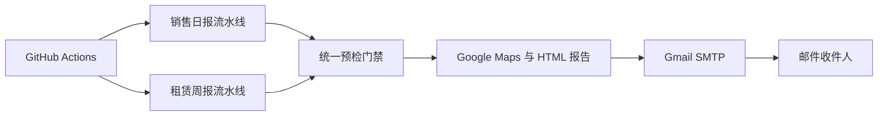

# Dublin House 2026

南都柏林住房销售日报与租赁周报的自动化监控、校验和邮件发送项目。

项目包含两条相互独立、共享基础组件的工作流：

| 任务 | 当前频率 | 主要内容 |
|---|---|---|
| **住房销售日报** | 每天 07:07（Europe/Dublin） | Affordable Purchase、开发商新房、私人二手房和 Watchlist |
| **住房租赁周报** | 每周一 07:07（Europe/Dublin） | 私人整租、一居室优先房源和 Cost Rental |

销售和租赁邮件统一采用 **2026-07-24 09:13（Europe/Dublin）邮件版式**。正式发送前必须通过数据、详情链接、摘要、Google Maps、模板和 SMTP 预检；任何关键检查失败都会停止发送。

## 系统架构

[打开交互式运行架构图](docs/architecture/dublin-house-2026.architecture.html)

相关文件：

- [Archify 架构源文件](docs/architecture/dublin-house-2026.architecture.json)
- [架构验证结果](docs/architecture/dublin-house-2026.validation.json)
- [架构交付记录](docs/architecture/dublin-house-2026.delivery.json)

当前架构图使用 Archify `showcase` 质量配置生成，验证结果为 **9/9 checks passed，0 errors，0 warnings**。



## 邮件内容

### 住房销售

- 本期重点与市场摘要
- Affordable Purchase
- 开发商新房
- 私人二手出售房
- Watchlist：Sale Agreed、申请关闭和资料待核实项目
- Google Maps 总览、编号项目清单和每套房源的独立地图链接

### 住房租赁

- 本期重点与市场摘要
- Daft.ie 等可靠公开来源的私人整租
- 优先一室一厅整租和较低总月租
- Cost Rental 的公开资格、申请状态和官方项目页
- Google Maps 总览、编号项目清单和每套房源的独立地图链接
- 邮件不写入个人姓名、雇主或收入等私人信息

## 快速开始

### 1. 安装环境

```bash
python3 -m venv .venv
source .venv/bin/activate
pip install -r requirements.txt
cp .env.example .env
```

在 `.env` 中配置：

```text
GOOGLE_MAPS_API_KEY=...
SMTP_HOST=smtp.gmail.com
SMTP_PORT=587
SMTP_USER=...
SMTP_APP_PASSWORD=...
EMAIL_TO=...
```

### 2. 准备数据

实际数据文件默认不提交到 Git。首次运行时可以从示例文件复制：

```bash
cp data/sales_listings.example.json data/sales_listings.json
cp data/private_rentals.example.json data/private_rentals.json
cp data/cost_rental.example.json data/cost_rental.json
```

每条房源记录应保留原始详情页 URL 和最近核实时间。销售任务还需要运行时的市场洞察数据文件。

### 3. 本地测试与生成

```bash
pytest -q
python scripts/run_sales.py
python scripts/run_rental.py
```

也可以直接使用示例数据测试：

```bash
python scripts/run_sales.py \
  --data-file data/sales_listings.example.json

python scripts/run_rental.py \
  --rental-file data/private_rentals.example.json \
  --cost-rental-file data/cost_rental.example.json
```

### 4. 发送前预检

```bash
python scripts/run_sales.py --preflight
python scripts/run_rental.py --preflight
```

预检会检查运行时数据、邮件结构、原始详情链接、Google Maps 总览与独立地图链接、静态地图生成和 SMTP 登录配置。

### 5. 发送邮件

```bash
python scripts/run_sales.py --send
python scripts/run_rental.py --send
```

`--send` 使用 fail-closed 策略：任何必要字段或发送条件不满足时，不会继续发送邮件。

## GitHub Actions

仓库包含以下定时工作流：

- [住房销售日报](.github/workflows/sales.yml)：每天运行
- [住房租赁周报](.github/workflows/rental.yml)：每周一运行
- [Archify 架构图生成](.github/workflows/archify-map.yml)：架构源文件更新时验证并生成交互式 HTML

工作流也支持在 GitHub Actions 页面手动触发。正式运行前，需要在仓库 `Settings → Secrets and variables → Actions` 中配置：

- `GOOGLE_MAPS_API_KEY`
- `SMTP_USER`
- `SMTP_APP_PASSWORD`
- `EMAIL_TO`

## 项目结构

```text
.github/workflows/       GitHub Actions 定时任务
data/                    示例数据与本地运行时数据
docs/                    配置、调度、邮件标准和架构文档
dublin_house/            销售、租赁、地图、校验与邮件核心逻辑
scripts/                 命令行运行入口
templates/               销售与租赁 HTML 邮件模板
tests/                   自动化测试
```

## 文档

- [配置与本地运行](docs/SETUP.md)
- [定时任务与 GitHub Actions](docs/SCHEDULING.md)
- [邮件统一标准](docs/EMAIL_STANDARD.md)
- [交互式运行架构图](docs/architecture/dublin-house-2026.architecture.html)

## 安全与合规

- Gmail App Password、Google Maps API Key 和收件人信息只能存放在本地 `.env` 或 GitHub Actions Secrets 中。
- Google Static Maps 图片由运行程序获取后以内嵌附件发送，API Key 不直接写入邮件 HTML。
- 项目不会绕过验证码、登录限制、速率限制或商业平台的反自动化措施。
- 房源状态和价格变化很快，生成邮件前必须重新核实原始页面。
- 示例数据不能作为正式房源直接发送；实际运行时数据缺失会使工作流失败并停止发送。
